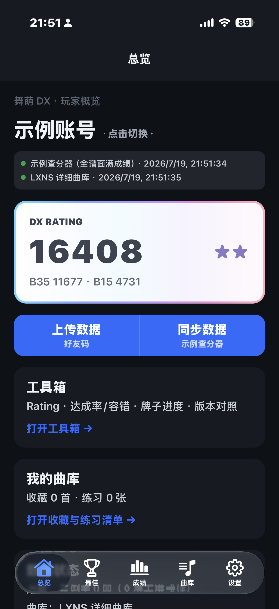
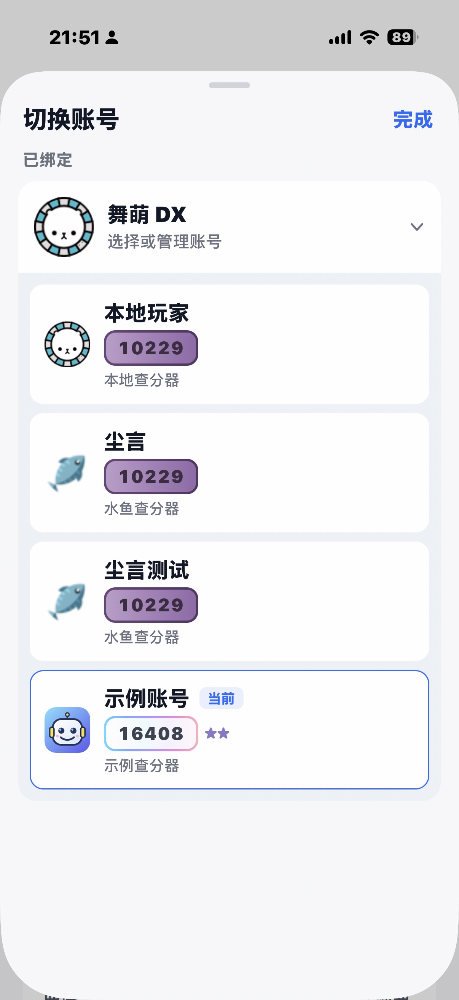
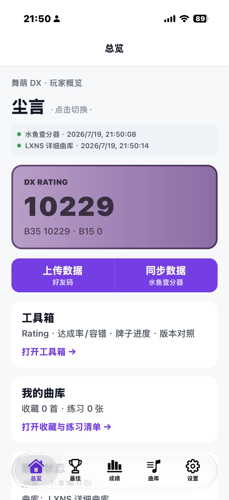
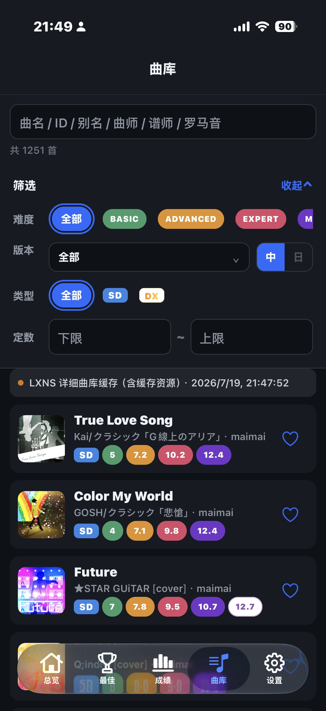
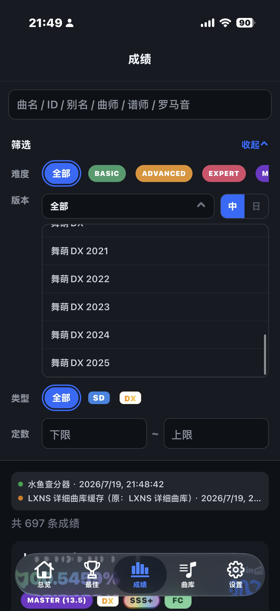
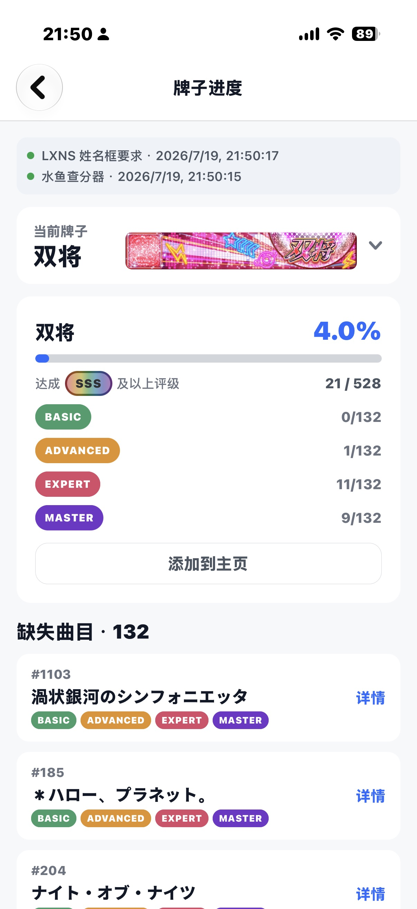
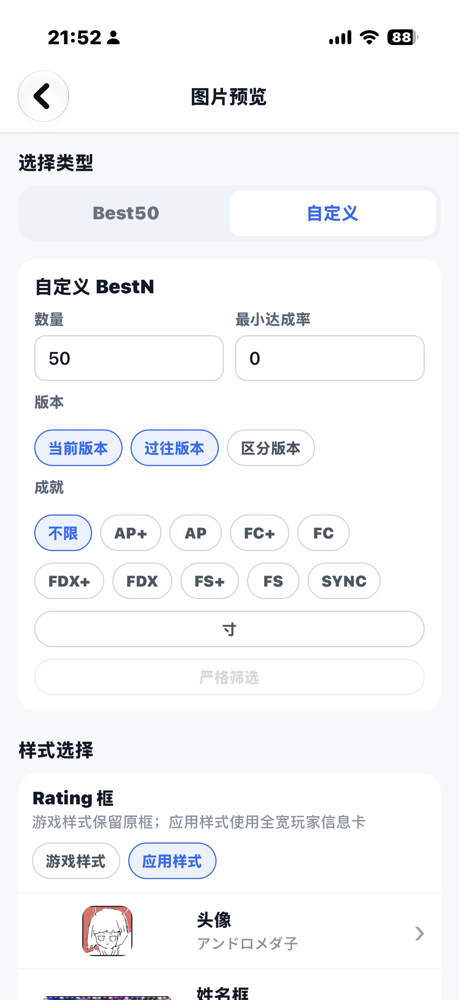
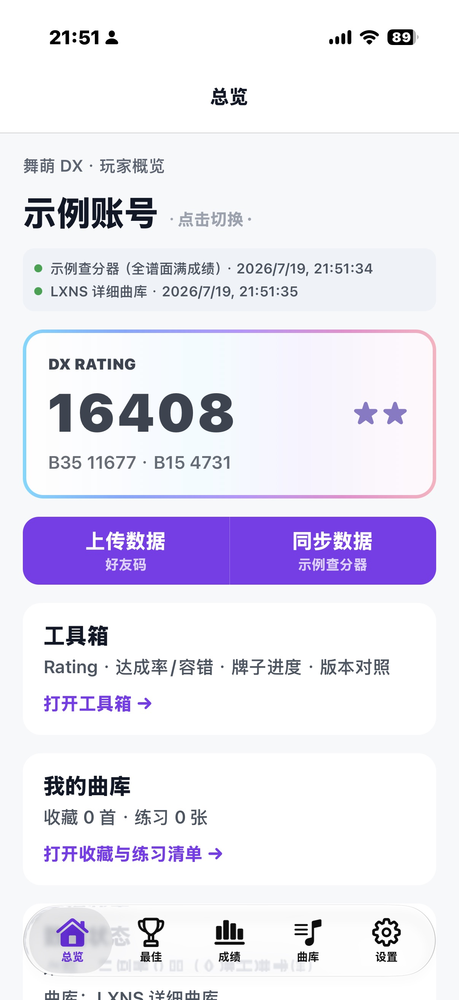

# rRanker

一款双端原生体验的音游查分器，目前聚焦舞萌 DX。聚合水鱼、落雪 OAuth 与本机快照，把成绩、曲库、牌子、成绩图片一次性握在手里。


## 能做什么

- **在总览查看 B35 / B15 与 DX Rating**：一目了然地查看最佳成绩、Rating 构成与数据来源状态。

  

- **多账号切换**：本地玩家、水鱼查分器、落雪查分器、示例账号可共存，随时切换。

  

- **浏览最佳成绩列表**：按过往版本 / 当前版本查看 Best35 / Best15，显示达成率、定数、Rating、DX / SD 等标签。

  

- **搜索与筛选曲库**：按曲名、ID、别名、曲师、谱师、罗马音搜索；按难度、版本、类型、定数区间筛选。

  

- **筛选成绩记录**：在成绩页按难度、版本（中服 / 日服）、谱面类型、定数区间快速过滤。

  

- **追踪牌子进度**：查看当前版本牌子的完成百分比、各难度达成计数与缺失曲目。

  

- **生成成绩图片并导出**：自定义 BestN 数量、最小达成率、版本范围、成就类型、头像与姓名框样式，导出 PNG 到相册。

  

- **多目标上传成绩**：输入好友码后，可选择上传到本地查分器或水鱼查分器。

  

- **深色模式与自定义主题色**：自动跟随系统深色模式，支持自定义主题色。

  

## 安全

- 密码只存在于当次登录请求的内存中。
- 水鱼上传凭证与落雪 OAuth refresh token 只写入系统 SecureStore，不进入 SQLite 或日志。
- 落雪 OAuth 使用 PKCE，应用内不保存 client_secret。
- SQLite 仅保存非敏感成绩快照，按账号隔离，并带 schema version。
- 不调用删除成绩的端点。

## 技术栈

Expo SDK 54 · Expo Router · React Native 0.81 · React 19 · TypeScript strict · Zustand · TanStack Query · Expo SQLite · Expo SecureStore

## 运行与构建

```powershell
# 安装依赖
npm install

# 开发
npm start
npm run android
npm run ios

# 检查
npm run typecheck
npm run lint
npm test

# 构建 APK
npm run apk:debug
npm run apk:release
```

## 许可证

本项目采用 [MIT License](LICENSE)，Copyright (c) 2026 Chnynnya。
