<div align="center">


# rRanker

[](LICENSE)
[]()
[](https://github.com/kckc7887/rRanker/releases)
[](https://github.com/kckc7887/rRanker/commits)
[]()

</div>
rRanker 是一个聚合了多家音乐游戏数据的数据管理应用，提供基本的玩家数据查询与其他便利功能。目前已经支持了以下游戏：

- 舞萌DX [[网站]](https://wc.wahlap.net/maidx/play/)
- 中二节奏 [[网站]](https://wc.wahlap.net/chunithm/play/)
- Phigros [[Apple Store]](https://apps.apple.com/cn/app/phigros/id1454809109) [[TapTap]](https://www.taptap.cn/app/165287?os=android) [[Google Play]](https://play.google.com/store/apps/details?id=com.PigeonGames.Phigros)
- 喵斯快跑 [[网站]](https://musedash.peropero.net/)
- 冰与火之舞 [[Steam]](https://store.steampowered.com/app/977950/_A_Dance_of_Fire_and_Ice/)

## 一些图片

### 舞萌DX Maimai DX
|总览|牌子|歌曲详情|谱面确认|导出图片|门曲|
|--|--|--|--|--|--|
||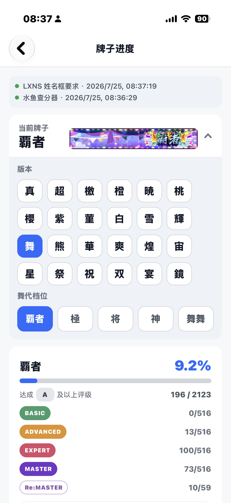|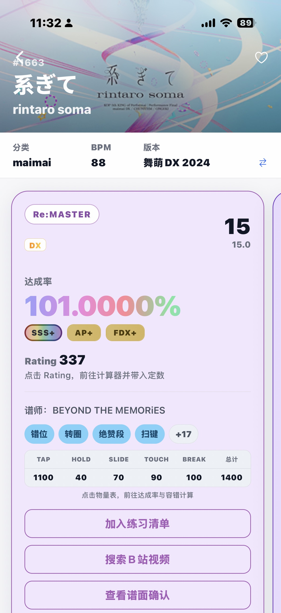|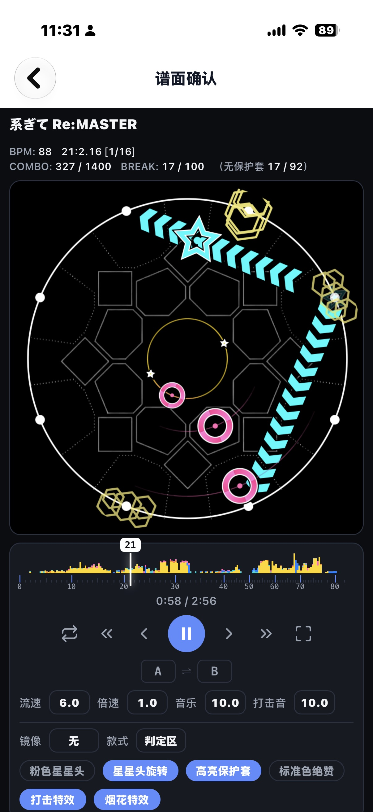||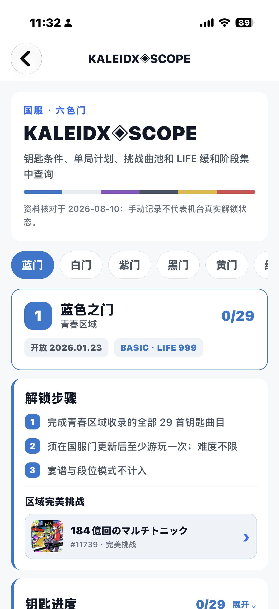|

### Phigros
|总览|成绩|推分计算|歌曲详情|实力分析|
|--|--|--|--|--|
|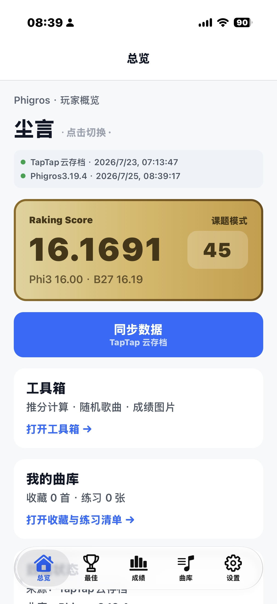|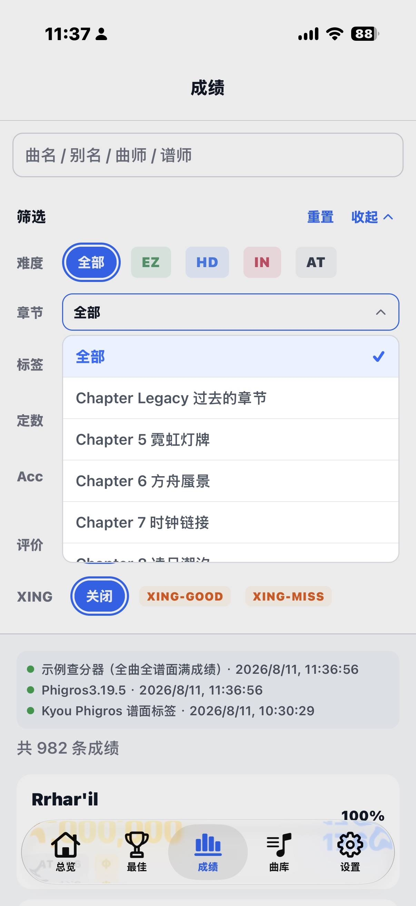|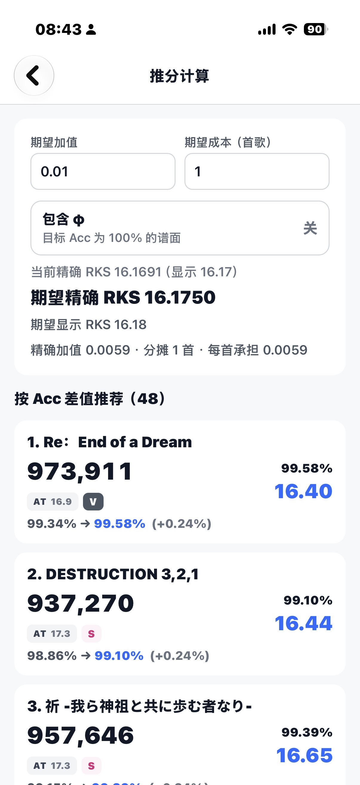|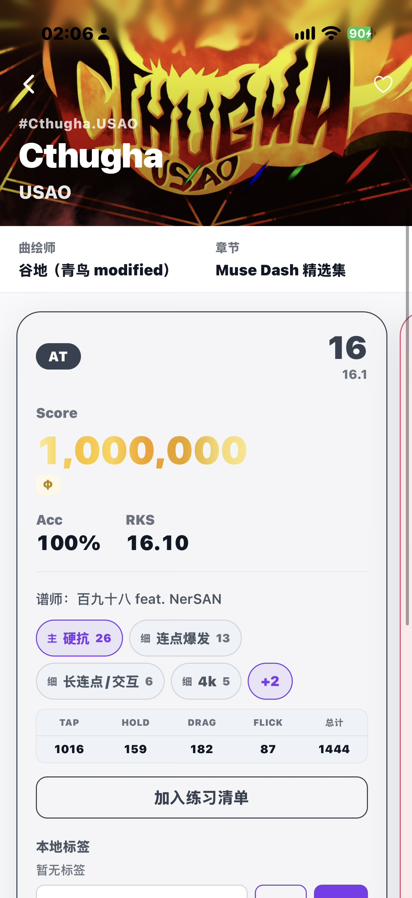|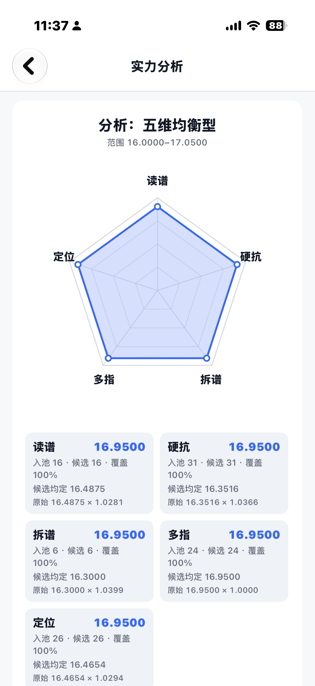|

### 中二节奏 CHUNITHM
|总览|收藏品|歌曲详情|导出图片|
|--|--|--|--|
|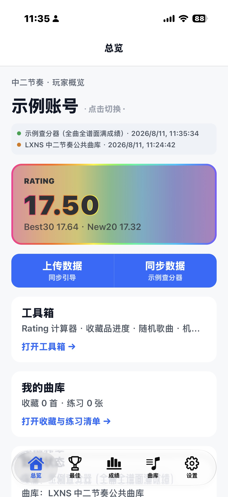|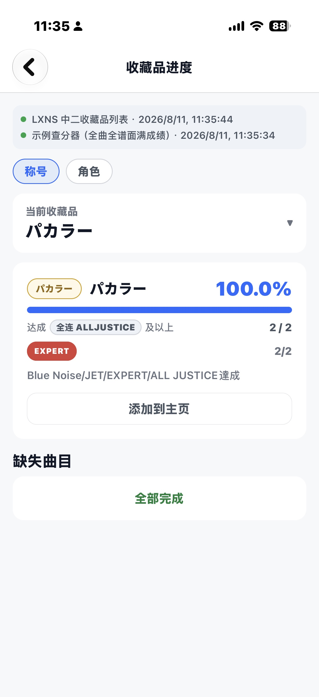|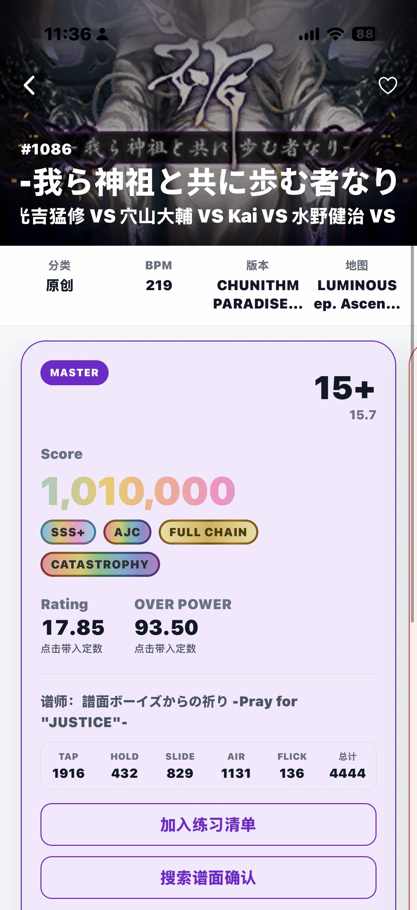||

### 喵斯快跑 MuseDash
|总览|成绩|歌曲详情|
|--|--|--|
||||

### 冰与火之舞 A Dance of Ice and Fire

|总览|
|--|
||

### 其它

|随机歌曲|曲库|主题|存储管理|机厅查找|
|--|--|--|--|--|
|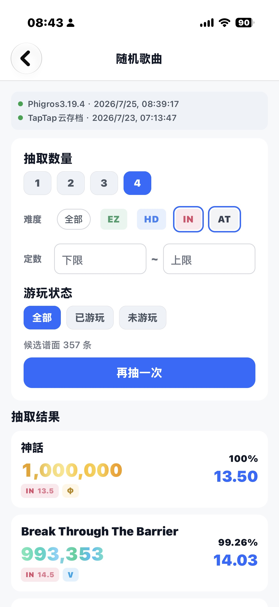|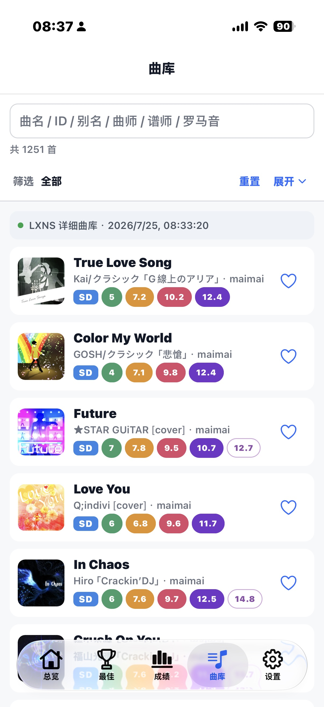|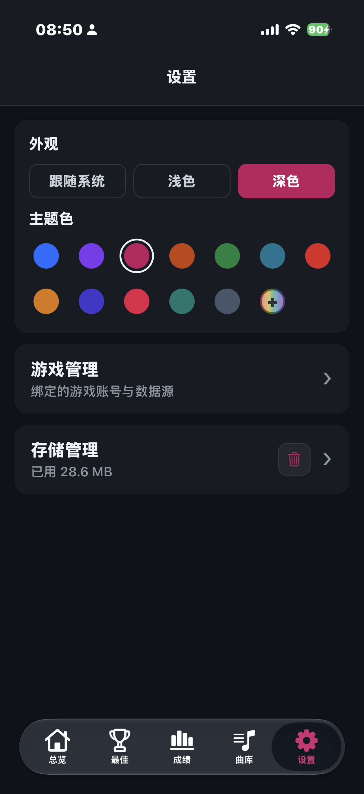|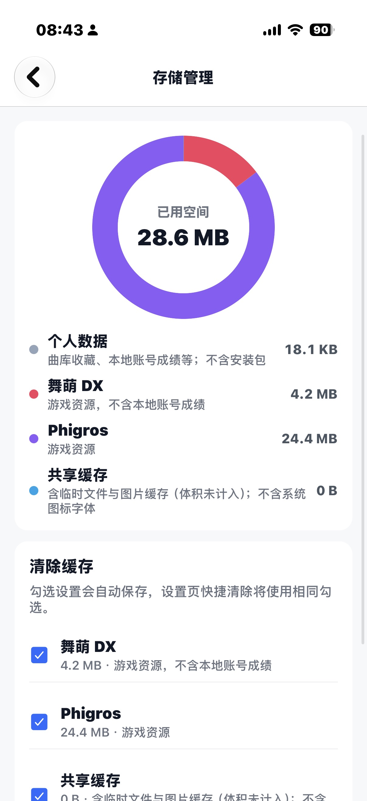|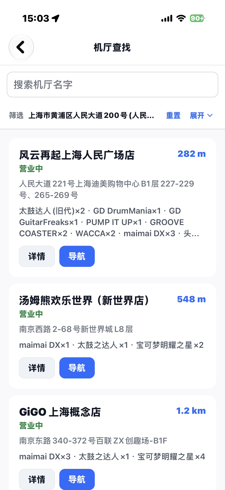|

## 主要功能

1. 🔑 登录玩家账号与查询玩家数据。
1. 🖼️ 生成成绩图片。
1. ⭐ 收藏歌曲、谱面，为歌曲、谱面打标签。
1. 🔍 查找附近机厅。
1. 🎨 切换主题色，深浅色模式，快捷清理缓存。
1. 🎲 随机歌曲推荐。
1. 🔧 更多功能......

## 🚀 快速开始

```bash
cd apps/mobile
npm install
npm start
```

## 🛠️ 技术栈

Expo SDK 54 · Expo Router · React Native 0.81 · React 19 · TypeScript strict · Zustand · TanStack Query · Expo SQLite · Expo SecureStore

## 🙏 致谢
- [Score Hub](https://github.com/bakapiano/maimai-score-hub)
- [水鱼查分器](https://maimai.diving-fish.com)
- [落雪咖啡屋](https://maimai.lxns.net/)
- [Phi-plugin](https://github.com/Catrong/phi-plugin)
- [maimai-prober-frontend](https://github.com/Lxns-Network/maimai-prober-frontend)（舞萌谱面预览引擎）
- [nonebot-plugin-maimaidx](https://github.com/Yuri-YuzuChaN/nonebot-plugin-maimaidx)（B50 成绩图布局）
- [maimaiDX](https://github.com/Yuri-YuzuChaN/maimaiDX)（B50 成绩图布局）
- [DXRating](https://github.com/gekichumai/dxrating)（谱面标签数据）
- [nearcade](https://nearcade.phizone.cn/)

## ⚠️ 声明

本项目仅提供数据管理功能，本项目与相关的任何游戏官方没有任何关系。

## 📜 许可证

本项目采用 [GNU Affero General Public License v3.0](LICENSE)（SPDX：`AGPL-3.0-only`），Copyright (c) 2026 尘言 潁川ホコリ。
