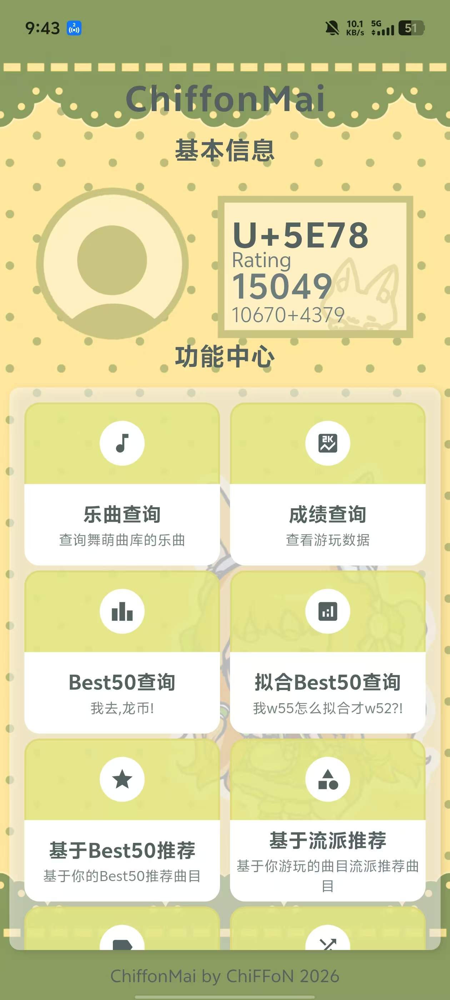
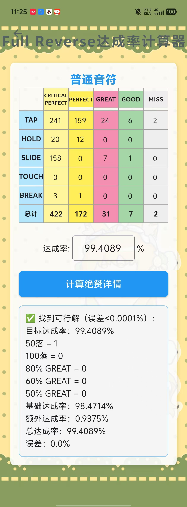
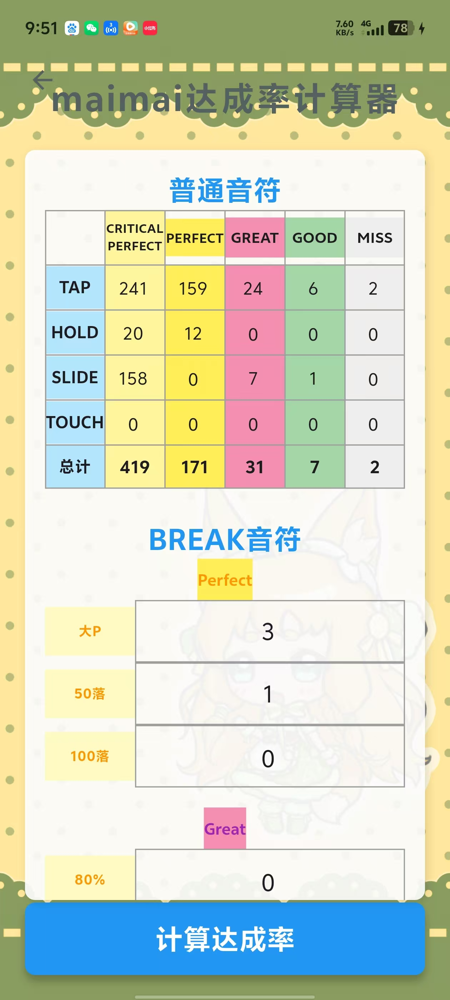
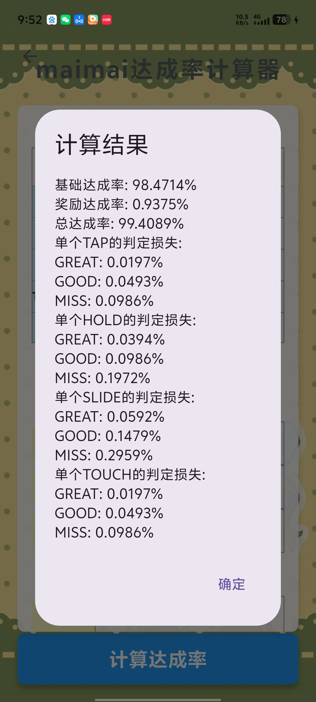

# ChiffonMai

  
  
  
  

 

ChiffonMai 是一款专为 **舞萌DX 2026(maimai DX 2026)** 玩家打造的一站式移动端工具类应用，聚合了曲库查询、成绩统计、Rating计算、曲目推荐等多种实用功能，助力玩家提升游玩体验。

## 🎉 特别致谢(排名不分先后)

- 感谢 [Xn1xUfguF1GiNg](https://huajia.163.com/main/profile/RrwM5xQB) 为本APP提供的背景图和戚风小狐狸（真的非常可爱）
- 感谢 **Takanashi Rikkkkkkka** 为本APP的个性化谱面推荐功能提供的宝贵的设计思路
- 感谢 **三由yyyh** 为本APP的页面设计提供的宝贵意见
- 感谢 **MYD** 提供的用于测试开发的个人游玩数据
- 感谢 [乐观的熊猫](https://space.bilibili.com/438391224?spm_id_from=333.788.upinfo.head.click) 提议开发ChiffonMai，为本项目诞生提供最初契机
- 感谢 [Diving-Fish](https://www.diving-fish.com/maimaidx/prober/) 提供的曲目数据库和玩家游玩记录数据库
- 感谢 [DXRating.net](https://dxrating.net) 提供的谱面标签数据库和别名数据库
- 感谢 [Yuri-YuzuChaN](https://github.com/Yuri-YuzuChaN/maimaiDX) 的提供的别名数据库
- 感谢 [落雪咖啡屋](https://maimai.lxns.net) 提供的收藏品数据库、歌曲音源支持、曲目数据库和玩家游玩记录数据库
- 感谢 [Neskol](https://github.com/Neskol/Maichart-Converts/tree/master) 提供的谱面转换支持
- 感谢 [status.awmc.cc](https://status.awmc.cc/status/maimai) 提供的舞萌服务器状态查询支持

## ✨ 设计思路借鉴

- [舞萌猜猜呗之潘一把](https://github.com/yukineko2233/v0-maimai-wordle)
- [EasyMai](https://github.com/Lista233/EasyMai)

## ✨ 核心功能

| 功能模块 | 功能描述 |
| :---: | :---: |
| 🎶 乐曲查询 | 全面检索舞萌DX曲库，展示所有乐曲的完整信息，便捷查找目标曲目 |
| 🎶 乐曲详情-查看谱面代码 | 提供全量谱面的maidata.txt，方便玩家研究谱面 |
| 🎶 乐曲详情-播放谱面 | 支持直接在应用内解析maidata.txt并播放谱面，无需下载到本地 |
| 🎶 自定义播放谱面 | 支持玩家自定义播放谱面（需要提供maidata.txt，曲绘和音源） |
| 📊 成绩查询 | 快速查看个人游玩数据、历史成绩记录，清晰呈现游玩轨迹与成长 |
| 🎯 牌子进度查询 | 查询个人当前的牌子（如白极/将/神/）进度，了解当前牌子状态与目标 |
| 🖼️ 牌子进度导出图片 | 支持将牌子进度一键导出为图片，方便保存与分享 |
| 🎯 个性化成绩查询 | 为推等级/谱师的极/将/神牌特别提供的功能 |
| 🖼️ 个性化成绩导出图片 | 支持将个性化成绩一键导出为图片分享 |
| 🏷️ 收藏品查询 | 查询各类收藏品详情，同步展示收藏品解锁条件，助力快速达成收集目标 |
| 🏆 Best50查询 | 自动计算个人Best50成绩，直观展示排名与分数，掌握自身实力水平 |
| 📈 拟合Best50查询 | 深度分析拟合Best50的拟合情况，提供数据参考，辅助优化游玩策略 |
| 📈 个性化Best50查询 | 支持多类个性化Best50查询，含锁血50、AP50等，满足不同查询需求 |
| 🖼️ Best50导出图片 | 支持将Best50/拟合Best50/个性化Best50一键导出为精美长图，方便分享 |
| 🔑 KALEIDXSCOPE | 查询国服门的进度和解锁攻略，了解最新动态 |
| 🏅 段位表 | 查询真代、里代等各段位达成条件与要求曲目，一目了然 |
| 📖 舞萌百科 | 查询舞萌DX专业术语、知识科普，帮助深入了解游戏机制（如"错位"、"蛇"等） |
| 🔍 基于标签推荐 | 根据谱面难度、音乐风格等标签精准匹配，推荐符合个人喜好的曲目 |
| 🎲 随机乐曲 | 随机生成1-4首曲目，打破固定游玩习惯，带来全新游玩体验 |
| 🧮 单曲Rating计算 | 输入单曲游玩数据，精准计算该曲目的Rating分数，明确单首曲目实力 |
| 📉 达成率计算 | 根据Perfect、Great等判定详情，精准核算单曲达成率，细化游玩细节 |
| 🔄 版本对照 | 清晰对照舞萌DX各版本名称与对应版本号（如maimai GreeN对应超代），便于区分版本 |
| 🔍 达成率反推 | 根据已知达成率，反向推算绝赞判定详情，辅助复盘游玩表现 |
| ⭐ 收藏夹 | 收藏喜爱的谱面，支持创建/重命名/删除收藏夹，便于管理 |
| 🎮 无提示猜歌 | 舞萌笑传之猜猜呗1，无任何提示，凭借记忆猜测曲目，趣味互动 |
| 🎮 根据部分曲绘猜歌 | 舞萌笑传之猜猜呗2，根据随机截取的部分曲绘，猜测对应曲目 |
| 🎮 根据模糊曲绘猜歌 | 舞萌笑传之猜猜呗3，根据随机截取的模糊曲绘，猜测对应曲目，考验对曲绘的熟悉度 |
| 🎮 根据歌曲片段猜歌 | 舞萌笑传之猜猜呗4，播放随机截取的歌曲片段，凭借旋律猜测曲目，感受听觉乐趣 |
| 🎮 根据别名猜歌 | 舞萌笑传之猜猜呗5，根据歌曲的常用别名，猜测对应曲目，考验对曲目细节的了解 |
| 🎮 舞萌开字母猜歌 | 舞萌笑传之猜猜呗6，通过揭示字符，猜测舞萌DX曲目，互动性拉满 |
| 🎮 多人猜歌游戏 | 支持与好友进行多人猜歌游戏（WebSocket实时对战），增加互动性 |
| 🏆 排行榜查询 | 查询总Rating排行榜、水鱼Rating排行榜、洛雪Rating排行榜，了解当前玩家排名与成绩（基于玩家自愿上传的成绩排名，不代表官方立场） |
| 🏆 特殊排行榜 | 绝赞数排行榜、物量排行榜、平均达成率排行榜、定数差值排行榜等11种多维排行 |
| 📡 服务器状态 | 实时查看当前服务器运行状态，及时了解服务器是否正常、有无异常情况 |
| 🔄 刷新数据 | 手动刷新当前页面数据，确保展示的是最新数据 |
| 🔔 检查更新 | 自动检测是否有新版本可用，及时提示用户更新，保障功能正常使用 |
| 📋 问卷反馈 | 内置问卷调查入口，用户可反馈建议助力APP改进 |

## ✨ 部分功能展示

  
  
  
  

## 📱 适配说明

- 支持Android/iOS双平台(iOS端暂未发布)

## 🛠️ 技术栈

- 开发框架：Flutter
- 编程语言：Dart

## 📥 安装方式

### 安卓端

1. 下载最新版APK文件 [服务器下载](https://wward.lanzouw.com/chiffonmai)
2. 允许安装未知来源应用
3. 安装并打开应用

### iOS端

1. 目前正在尽力协调iOS端的发布，敬请期待

## 📄 隐私说明

- 应用仅在本地存储你的游戏数据，不会上传至第三方服务器
- 账号绑定仅用于同步官方数据，不会收集敏感信息
- 所有计算逻辑均在本地完成，保障数据安全

## 📝 许可证

本项目采用 [MIT License](LICENSE) 开源许可证，详细条款请查看LICENSE文件。

## 💡 免责声明

- ChiffonMai 是第三方工具，非SEGA官方出品
- 本应用仅用于学习和娱乐，请勿用于商业用途
- 数据来源均为公开信息，如有侵权请联系删除

## 📞 反馈与建议

- 邮箱：chiffonowo@foxmail.com